# Mindspace ML Pipeline — Detailed Step-by-Step Flow

> Every step of the pipeline in a single diagram with full descriptions, actual parameters, and results.

```mermaid
flowchart TD
    S0["🖥️ <b>Step 0 — Import & Hardware Detection</b>\nLoad all libraries: pandas, sklearn, xgboost, lightgbm, optuna\nDetect GPU via PyTorch CUDA · Count CPU cores\n<i>Output: GPU_AVAILABLE, CPU_COUNT</i>"]

    S1["📁 <b>Step 1 — Configuration</b>\nFILE_PATH = data/mental_health_...csv\nRANDOM_SEED = 42\nOUTPUT_DIR = pipeline_output/"]

    S2["📂 <b>Step 2 — Data Loading</b>\nLoad CSV into DataFrame\n<b>50,000 rows × 66 columns</b>\n61 float · 3 object · 2 int"]

    S3["📋 <b>Step 3 — Column Overview</b>\nPrint all 66 column names\nUser reviews before setting target"]

    S4["🎯 <b>Step 4 — Target Selection</b>\nTARGET_COLUMN = 'profile'\nTASK_TYPE auto-detected = classification\n7 unique classes"]

    S5["🔬 <b>Step 5 — Data Profiling & Quality Audit</b>\nCheck: nulls, duplicates, constant cols, ID-like cols\nHigh-cardinality categoricals\n<b>Leakage detected:</b> 'target' has 1-to-1 mapping with 'profile'\n→ Flagged for removal"]

    S6["🧹 <b>Step 6 — Auto-Clean</b>\nDrop 'target' column (leakage)\nImpute remaining nulls (none found)\nResult: <b>50,000 × 65</b>"]

    S7["✂️ <b>Step 7 — Target Analysis & Train/Test Split</b>\n7 classes · Imbalance ratio 2.54:1\nBalance strategy: class_weight='balanced'\n<b>Train: 40,000 · Test: 10,000</b> (80/20 stratified)\n⚠️ ALL transforms below fit on TRAIN only"]

    S8["📊 <b>Step 8 — Outlier Handling (Smoothing)</b>\nDetect outliers via IQR on training data\nFor each column with >0.3% outliers:\n  Test: Winsorize · Log1p · Sqrt · Yeo-Johnson\n  Pick strategy with lowest |skewness|\n<b>63 columns treated · 0 rows removed</b>\nFit on train → apply to both sets"]

    S9["🔤 <b>Step 9 — Feature Encoding</b>\nBinary (2 values) → Label Encoding\nLow-cardinality (3–10) → One-Hot (drop_first=False)\nHigh-cardinality (11+) → Frequency Encoding\nFit on train categories → apply to both sets\nAll encoding mappings saved"]

    S10["📈 <b>Step 10 — EDA & Visualization (Train Only)</b>\nDistribution plots for all numeric features\nCorrelation heatmap\nKruskal-Wallis H test (feature vs target)\nLevene's W test (variance homogeneity)\nAll analysis on training data only"]

    S11["🎯 <b>Step 11 — Feature Selection (Multi-Method Consensus)</b>\n1. Correlation filter: remove one from pairs |r| ≥ 0.85\n2. VIF iteration: remove VIF > 10 (top-25% protected)\n3. Random Forest MDI importance ranking\n4. Mutual Information scores\n5. Statistical tests: Kruskal-Wallis + Levene's\nConsensus ranking → prune MI < 0.01\n<b>65 features → 43 features</b>"]

    S12["⚖️ <b>Step 12 — Feature Scaling</b>\nScaler: RobustScaler (chosen for outlier robustness)\nFit on train → transform both\nConvert DataFrames to numpy arrays\n<b>X_train: 40K × 43 · X_test: 10K × 43</b>"]

    S13["🤖 <b>Step 13 — Model Shortlisting</b>\n8 candidates selected based on dataset size:\n  1. Random Forest    5. HistGradientBoosting\n  2. LightGBM (GPU)   6. Logistic Regression\n  3. Extra Trees       7. SVM-RBF\n  4. XGBoost (GPU)    8. KNN\nclass_weight='balanced' where supported\nsample_weight for XGBoost"]

    S14["🏋️ <b>Step 14 — Model Training & CV Ranking</b>\n5-fold Stratified Cross-Validation\nScoring: <b>f1_macro</b> (primary metric)\nn_jobs=-1 for parallel fold execution\nsample_weight models → manual CV with joblib.Parallel\nAll 8 models scored and ranked"]

    S15["🏆 <b>Step 15 — Top-K Selection</b>\nSelect top 2 models by CV score\nfor hyperparameter tuning\n<b>#1 LightGBM · #2 HistGradientBoosting</b>"]

    S16["🎛️ <b>Step 16 — Hyperparameter Tuning (Optuna)</b>\nOptimizer: TPE (Bayesian) sampler\n15 trials per model · 3 min timeout each\n5-fold Stratified CV per trial · f1_macro scoring\nGPU flags for XGBoost/LightGBM\nTuned: n_estimators, max_depth, learning_rate,\nnum_leaves, subsample, colsample, regularization"]

    S17["✅ <b>Step 17 — Final Evaluation on Test Set</b>\nRetrain best model on full training set\nEvaluate on held-out 10K test samples\n<b>Best: LightGBM</b>\n  Accuracy: 0.920 · F1 macro: 0.918\n  F1 weighted: 0.920 · Precision: 0.917 · Recall: 0.920\nClassification report · Confusion matrix\nRunner-up (HistGradientBoosting) also evaluated"]

    S18["💾 <b>Step 18 — Save All Artifacts</b>\nFolder: pipeline_output/LightGBM_13032026_110356/\n  best_model.joblib — trained model\n  scaler.joblib — RobustScaler\n  label_encoder.joblib — 7 class mappings\n  encoding_artifacts.joblib — categorical encoders\n  outlier_transformers.joblib — per-column transforms\n  feature_names.json — 43 selected features\n  model_metadata.json — metrics, params, classes\n  pipeline_state.json — full run state"]

    S0 --> S1 --> S2 --> S3 --> S4
    S4 --> S5 --> S6 --> S7
    S7 --> S8 --> S9 --> S10
    S10 --> S11 --> S12 --> S13
    S13 --> S14 --> S15 --> S16
    S16 --> S17 --> S18

    S7 -. "Test set (10K) held out — no leakage" .-> S17

    style S0 fill:#1a1a2e,stroke:#e94560,color:#fff
    style S1 fill:#1a1a2e,stroke:#e94560,color:#fff
    style S2 fill:#16213e,stroke:#0f3460,color:#fff
    style S3 fill:#16213e,stroke:#0f3460,color:#fff
    style S4 fill:#16213e,stroke:#0f3460,color:#fff
    style S5 fill:#16213e,stroke:#53a8b6,color:#fff
    style S6 fill:#16213e,stroke:#53a8b6,color:#fff
    style S7 fill:#533483,stroke:#e94560,color:#fff
    style S8 fill:#0f3460,stroke:#53a8b6,color:#fff
    style S9 fill:#0f3460,stroke:#53a8b6,color:#fff
    style S10 fill:#1b4332,stroke:#52b788,color:#fff
    style S11 fill:#3a0ca3,stroke:#7209b7,color:#fff
    style S12 fill:#3a0ca3,stroke:#7209b7,color:#fff
    style S13 fill:#6a040f,stroke:#d00000,color:#fff
    style S14 fill:#6a040f,stroke:#d00000,color:#fff
    style S15 fill:#6a040f,stroke:#d00000,color:#fff
    style S16 fill:#ff6d00,stroke:#ff9e00,color:#fff
    style S17 fill:#2d6a4f,stroke:#40916c,color:#fff
    style S18 fill:#2d6a4f,stroke:#40916c,color:#fff
```

### Color Legend

| Color | Phase | Steps |
|-------|-------|-------|
| 🟥 Dark red/pink | Setup | 0–1 |
| 🔵 Navy blue | Data Loading | 2–4 |
| 🔷 Teal blue | Profiling & Clean | 5–6 |
| 🟣 Purple | Train/Test Split | 7 |
| 🔷 Dark teal | Feature Transforms | 8–9 |
| 🟢 Dark green | EDA | 10 |
| 🟪 Violet | Feature Selection & Scaling | 11–12 |
| 🔴 Deep red | Model Training | 13–15 |
| 🟠 Orange | Hyperparameter Tuning | 16 |
| 🟩 Green | Evaluation & Save | 17–18 |
| ⬜ Dashed line | Test set bypass | 7 → 17 (no leakage) |
