# Mindspace ML Pipeline — Detailed Step-by-Step Flow

> Every step of the pipeline in a single diagram with full descriptions, actual parameters, and results.

```mermaid
flowchart TD
    S0["🖥️ <b>STEP 0 — Import Libraries & Hardware Detection</b>"]
    S0D["Load: pandas · numpy · sklearn · xgboost · lightgbm · optuna · joblib\nDetect CUDA GPU via PyTorch → NVIDIA GTX 1650 Ti found\nCount CPU cores → 8 cores\nSet: GPU_AVAILABLE=True · CPU_COUNT=8"]

    S1["📁 <b>STEP 1 — Configuration</b>"]
    S1D["FILE_PATH = data/mental_health_synthetic_dataset_with_normal.csv\nRANDOM_SEED = 42\nOUTPUT_DIR = pipeline_output/"]

    S2["📂 <b>STEP 2 — Data Loading</b>"]
    S2D["Read CSV with pandas\nShape: 50,000 rows × 66 columns\nDtypes: 61 float64 · 3 object · 2 int64\nPreview: head(), dtypes, memory usage"]

    S3["📋 <b>STEP 3 — Column Overview</b>"]
    S3D["Print all 66 column names with dtype and unique count\nUser reviews columns before choosing target"]

    S4["🎯 <b>STEP 4 — Target Column Selection</b>"]
    S4D["USER sets: TARGET_COLUMN = 'profile'\nAuto-detect task: 7 unique values → classification\nExtract target series · Separate features from target"]

    S5["🔬 <b>STEP 5 — Data Profiling & Quality Audit</b>"]
    S5D["Check null values → 0 found\nCheck duplicates → 0 found\nCheck constant columns → 0 found\nCheck ID-like columns → 0 found\nCheck high-cardinality categoricals → 0 found\n🚨 Leakage detected: 'target' column has perfect 1-to-1 mapping with 'profile'\n→ Flagged for removal"]

    S6["🧹 <b>STEP 6 — Auto-Clean</b>"]
    S6D["Drop 'target' column (leakage)\nImpute remaining nulls → none needed\nReset index after any row removal\nResult: 50,000 rows × 65 columns"]

    S7["✂️ <b>STEP 7 — Target Analysis & Train/Test Split</b>"]
    S7D["Analyze 7 classes: Anxiety · Bipolar_Mania · Depression · Normal · Phobia · Stress · Suicidal_Tendency\nImbalance ratio: 2.54:1\nBalance strategy chosen: class_weight='balanced'\nStratified split → Train: 40,000 rows · Test: 10,000 rows\n⚠️ Hard boundary — all transforms below fit on TRAIN only"]

    S8["📊 <b>STEP 8 — Outlier Handling (Smoothing Only)</b>"]
    S8D["Detect outliers via IQR method on training data only\nFor each column with > 0.3% outliers, test 4 strategies:\n  → Winsorize (cap to IQR bounds)\n  → Log1p (for right-skewed non-negative)\n  → Square root (for moderate skew non-negative)\n  → Yeo-Johnson (works for any distribution)\nPick strategy with lowest |skewness| per column\n63 columns treated · 0 rows removed · All transformers saved\nApply fitted transforms to test set identically"]

    S9["🔤 <b>STEP 9 — Feature Encoding</b>"]
    S9D["Binary columns (2 unique) → Label Encoding\nLow-cardinality (3–10 unique) → One-Hot Encoding (drop_first=False)\nHigh-cardinality (11+ unique) → Frequency Encoding\nAll encoders fit on TRAIN categories only\nApply to test set (unseen categories handled gracefully)\nSave all encoding mappings as artifacts"]

    S10["📈 <b>STEP 10 — EDA & Visualization</b>"]
    S10D["All analysis on TRAINING data only:\n  → Distribution plots for all numeric features\n  → Correlation heatmap (Pearson)\n  → Kruskal-Wallis H test: feature significance vs target\n  → Levene's W test: variance homogeneity across classes\nGenerate plots and statistical summaries"]

    S11["🎯 <b>STEP 11 — Feature Selection (Multi-Method Consensus)</b>"]
    S11D["Phase 1 — Correlation filter: remove one from pairs with |r| ≥ 0.85\nPhase 2 — VIF iteration: remove features with VIF > 10\n  (top-25% importance features are PROTECTED from removal)\nPhase 3 — Three independent rankers on remaining features:\n  → Random Forest MDI importance ranking\n  → Mutual Information scores\n  → Statistical tests (Kruskal-Wallis H + Levene's W)\nPhase 4 — Average ranks across 3 methods → consensus ranking\nPhase 5 — Prune features with MI < 0.01 threshold\nResult: 65 features → 43 features retained"]

    S12["⚖️ <b>STEP 12 — Feature Scaling</b>"]
    S12D["Choose scaler based on data: RobustScaler (handles outliers well)\nFit scaler on training data only\nTransform both train and test\nConvert DataFrames → numpy arrays\nFinal shape: X_train 40K × 43 · X_test 10K × 43"]

    S13["🤖 <b>STEP 13 — Model Shortlisting</b>"]
    S13D["Dynamically select models based on dataset size and dimensionality:\n  1. Random Forest (n_jobs=-1)\n  2. LightGBM (device=gpu)\n  3. Extra Trees (n_jobs=-1)\n  4. XGBoost (device=cuda)\n  5. HistGradientBoosting (native multi-core)\n  6. Logistic Regression\n  7. SVM with RBF kernel\n  8. K-Nearest Neighbors\nSet class_weight='balanced' where supported\nCompute sample_weight for XGBoost (no class_weight param)"]

    S14["🏋️ <b>STEP 14 — Model Training & Cross-Validation</b>"]
    S14D["5-fold Stratified Cross-Validation for all 8 models\nScoring metric: f1_macro (primary)\nStandard models: sklearn cross_val_score with n_jobs=-1\nsample_weight models (XGBoost): manual CV loop\n  with joblib.Parallel for parallel fold execution\nRecord mean score and std for each model\nRank all models by CV f1_macro score"]

    S15["🏆 <b>STEP 15 — Top-K Model Selection</b>"]
    S15D["Select top 2 models by CV score for tuning:\n  🥇 #1: LightGBM\n  🥈 #2: HistGradientBoosting"]

    S16["🎛️ <b>STEP 16 — Hyperparameter Tuning (Optuna)</b>"]
    S16D["Optimizer: TPE (Tree-structured Parzen Estimator) sampler\n15 trials per model · 3 minute hard timeout per model\n5-fold Stratified CV per trial · Scoring: f1_macro\nGPU flags applied for XGBoost and LightGBM\nTuned parameters: n_estimators · max_depth · learning_rate\n  num_leaves · subsample · colsample_bytree\n  min_child_samples · reg_alpha · reg_lambda\nBest LightGBM CV score: 0.9197"]

    S17["✅ <b>STEP 17 — Final Evaluation on Test Set</b>"]
    S17D["Retrain best tuned model on full 40K training set\nPredict on held-out 10K test set\n<b>Best Model: LightGBM</b>\n  Accuracy: 0.920 · F1 macro: 0.918 · F1 weighted: 0.920\n  Precision macro: 0.917 · Recall macro: 0.920\nPer-class classification report\nConfusion matrix (absolute + normalized)\nRunner-up (HistGradientBoosting) also evaluated for comparison"]

    S18["💾 <b>STEP 18 — Save All Artifacts</b>"]
    S18D["Output folder: pipeline_output/LightGBM_13032026_110356/\nSaved files:\n  → best_model.joblib (trained LightGBM)\n  → scaler.joblib (RobustScaler)\n  → label_encoder.joblib (7 class mappings)\n  → encoding_artifacts.joblib (categorical encoders)\n  → outlier_transformers.joblib (per-column transforms)\n  → feature_names.json (43 selected features)\n  → model_metadata.json (metrics · params · class names)\n  → pipeline_state.json (complete run state)"]

    S0 --> S0D --> S1 --> S1D --> S2 --> S2D --> S3 --> S3D
    S3D --> S4 --> S4D --> S5 --> S5D --> S6 --> S6D
    S6D --> S7 --> S7D --> S8 --> S8D --> S9 --> S9D
    S9D --> S10 --> S10D --> S11 --> S11D --> S12 --> S12D
    S12D --> S13 --> S13D --> S14 --> S14D --> S15 --> S15D
    S15D --> S16 --> S16D --> S17 --> S17D --> S18 --> S18D

    S7 -. "Test set (10K) held out — joins here" .-> S17

    style S0 fill:#e94560,stroke:#e94560,color:#fff
    style S0D fill:#1a1a2e,stroke:#e94560,color:#fff
    style S1 fill:#e94560,stroke:#e94560,color:#fff
    style S1D fill:#1a1a2e,stroke:#e94560,color:#fff
    style S2 fill:#0f3460,stroke:#0f3460,color:#fff
    style S2D fill:#16213e,stroke:#0f3460,color:#fff
    style S3 fill:#0f3460,stroke:#0f3460,color:#fff
    style S3D fill:#16213e,stroke:#0f3460,color:#fff
    style S4 fill:#0f3460,stroke:#0f3460,color:#fff
    style S4D fill:#16213e,stroke:#0f3460,color:#fff
    style S5 fill:#53a8b6,stroke:#53a8b6,color:#fff
    style S5D fill:#16213e,stroke:#53a8b6,color:#fff
    style S6 fill:#53a8b6,stroke:#53a8b6,color:#fff
    style S6D fill:#16213e,stroke:#53a8b6,color:#fff
    style S7 fill:#e94560,stroke:#533483,color:#fff
    style S7D fill:#533483,stroke:#e94560,color:#fff
    style S8 fill:#53a8b6,stroke:#53a8b6,color:#fff
    style S8D fill:#0f3460,stroke:#53a8b6,color:#fff
    style S9 fill:#53a8b6,stroke:#53a8b6,color:#fff
    style S9D fill:#0f3460,stroke:#53a8b6,color:#fff
    style S10 fill:#52b788,stroke:#52b788,color:#fff
    style S10D fill:#1b4332,stroke:#52b788,color:#fff
    style S11 fill:#7209b7,stroke:#7209b7,color:#fff
    style S11D fill:#3a0ca3,stroke:#7209b7,color:#fff
    style S12 fill:#7209b7,stroke:#7209b7,color:#fff
    style S12D fill:#3a0ca3,stroke:#7209b7,color:#fff
    style S13 fill:#d00000,stroke:#d00000,color:#fff
    style S13D fill:#6a040f,stroke:#d00000,color:#fff
    style S14 fill:#d00000,stroke:#d00000,color:#fff
    style S14D fill:#6a040f,stroke:#d00000,color:#fff
    style S15 fill:#d00000,stroke:#d00000,color:#fff
    style S15D fill:#6a040f,stroke:#d00000,color:#fff
    style S16 fill:#ff9e00,stroke:#ff9e00,color:#fff
    style S16D fill:#ff6d00,stroke:#ff9e00,color:#fff
    style S17 fill:#40916c,stroke:#40916c,color:#fff
    style S17D fill:#2d6a4f,stroke:#40916c,color:#fff
    style S18 fill:#40916c,stroke:#40916c,color:#fff
    style S18D fill:#2d6a4f,stroke:#40916c,color:#fff
```

### Color Legend

| Color | Phase | Steps |
|-------|-------|-------|
| 🟥 Pink/Red | Setup & Config | 0–1 |
| 🔵 Navy Blue | Data Loading | 2–4 |
| 🔷 Teal | Profiling & Clean | 5–6 |
| 🟣 Purple | Train/Test Split | 7 |
| 🔷 Dark Teal | Feature Transforms | 8–9 |
| 🟢 Green | EDA | 10 |
| 🟪 Violet | Feature Selection & Scaling | 11–12 |
| 🔴 Deep Red | Model Training | 13–15 |
| 🟠 Orange | Hyperparameter Tuning | 16 |
| 🟩 Green | Evaluation & Save | 17–18 |
| ⬜ Dashed line | Test set bypass | 7 → 17 (no leakage) |
