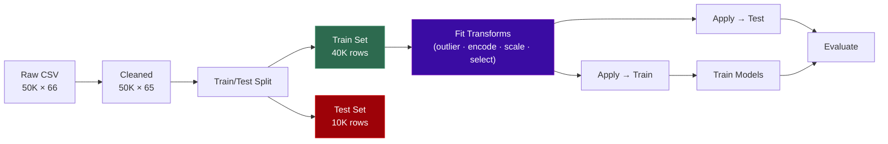
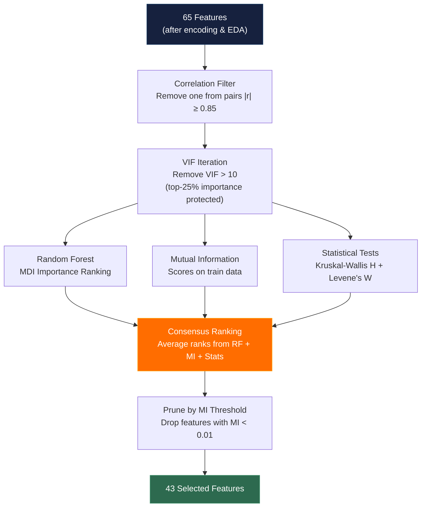
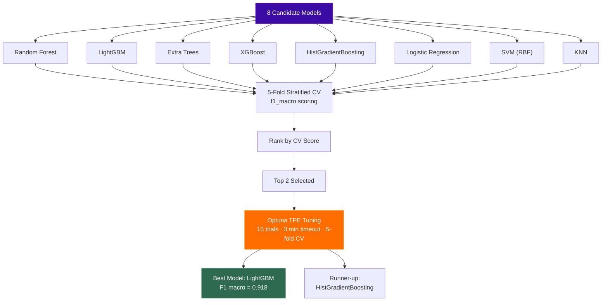
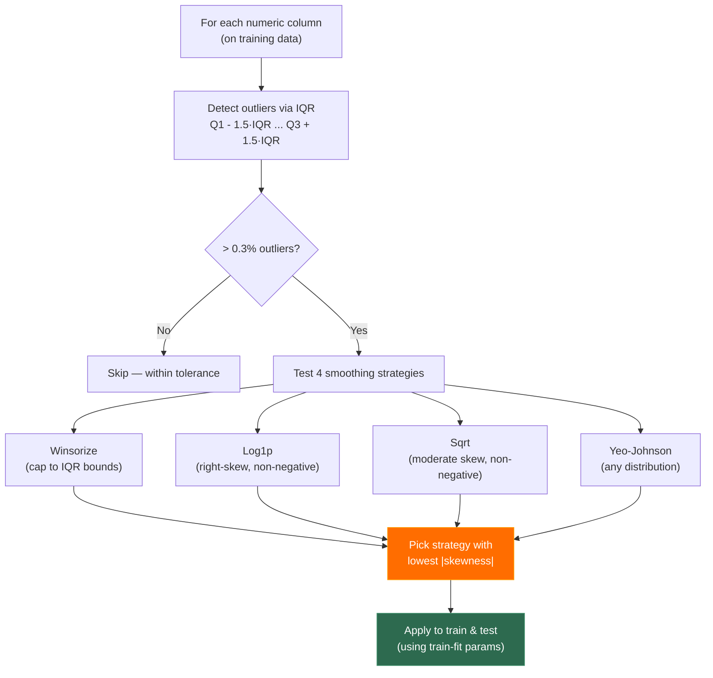
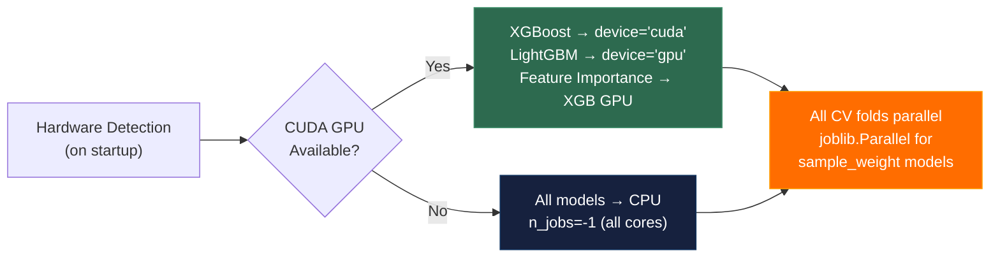
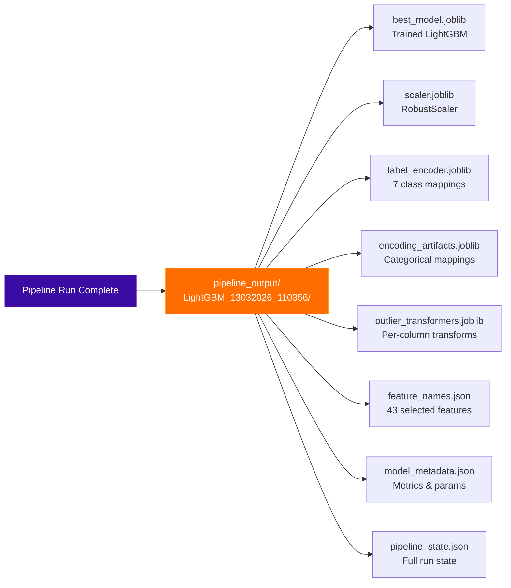

# Mindspace ML Pipeline — Diagrams

## 1. End-to-End Pipeline Flow

```mermaid
flowchart LR
    %% ── Phase 1: Setup & Load ──
    subgraph P1[" "]
        direction TB
        S0(["⚙️ Step 0\nImports &\nHardware Detection"])
        S1(["📁 Step 1\nConfiguration"])
        S0 --> S1
    end

    subgraph P2[" "]
        direction TB
        S2(["📂 Step 2\nLoad CSV\n50K × 66"])
        S3(["🔍 Step 3\nColumn Overview"])
        S4(["🎯 Step 4\nTarget = profile"])
        S2 --> S3 --> S4
    end

    subgraph P3[" "]
        direction TB
        S5(["🧪 Step 5\nData Profiling\nNulls · Leakage"])
        S6(["🧹 Step 6\nAuto-Clean\nDrop leakage col"])
        S5 --> S6
    end

    %% ── Phase 2: Split (the hard boundary) ──
    S7{{"✂️ Step 7\nTrain/Test Split\n40K / 10K\nStratified"}}

    %% ── Phase 3: Train-only transforms ──
    subgraph P4["🔧 Transform (fit on train)"]
        direction TB
        S8(["Step 8 · Outlier Smoothing\n4 strategies → lowest skew"])
        S9(["Step 9 · Encoding\nLabel · One-Hot · Frequency"])
        S8 --> S9
    end

    subgraph P5["📊 Analyze"]
        S10(["Step 10 · EDA\nDistributions · Correlations\nKruskal-Wallis · Levene's"])
    end

    subgraph P6["🎯 Select & Scale"]
        direction TB
        S11(["Step 11 · Feature Selection\nCorr → VIF → RF+MI+Stats\n65 → 43 features"])
        S12(["Step 12 · RobustScaler"])
        S11 --> S12
    end

    %% ── Phase 4: Model Training ──
    subgraph P7["🏋️ Train & Compare"]
        direction TB
        S13(["Step 13 · Shortlist\n8 candidate models"])
        S14(["Step 14 · 5-Fold CV\nf1_macro · parallel"])
        S15(["Step 15 · Top-2\nselection"])
        S13 --> S14 --> S15
    end

    %% ── Phase 5: Tuning ──
    subgraph P8["🎛️ Tune"]
        S16(["Step 16 · Optuna TPE\n15 trials · 3 min\n5-fold CV"])
    end

    %% ── Phase 6: Evaluate & Save ──
    subgraph P9["✅ Deliver"]
        direction TB
        S17(["Step 17 · Final Eval\nAccuracy 92% · F1 0.918\nConfusion Matrix"])
        S18(["Step 18 · Save\nmodel · scaler · encoder\ntransformers · metadata"])
        S17 --> S18
    end

    %% ── Connections ──
    P1 --> P2 --> P3
    P3 --> S7
    S7 -->|"Train 40K"| P4
    P4 --> P5 --> P6 --> P7 --> P8
    P8 --> P9

    %% ── Test set bypass (no leakage) ──
    S7 -.->|"Test 10K held out"| S17

    %% ── Styles ──
    style P1 fill:#1a1a2e,stroke:#e94560,color:#fff
    style P2 fill:#16213e,stroke:#0f3460,color:#fff
    style P3 fill:#16213e,stroke:#0f3460,color:#fff
    style S7 fill:#533483,stroke:#e94560,color:#fff
    style P4 fill:#0f3460,stroke:#53a8b6,color:#fff
    style P5 fill:#1b4332,stroke:#52b788,color:#fff
    style P6 fill:#3a0ca3,stroke:#7209b7,color:#fff
    style P7 fill:#6a040f,stroke:#d00000,color:#fff
    style P8 fill:#ff6d00,stroke:#ff9e00,color:#fff
    style P9 fill:#2d6a4f,stroke:#40916c,color:#fff
```

---

## 2. Anti-Leakage Data Flow

---

## 3. Feature Selection Pipeline

---

## 4. Model Selection & Tuning Flow

---

## 5. Outlier Handling Strategy

---

## 6. Hardware Utilization

---

## 7. Saved Artifacts

