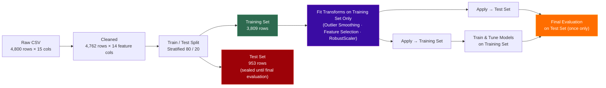
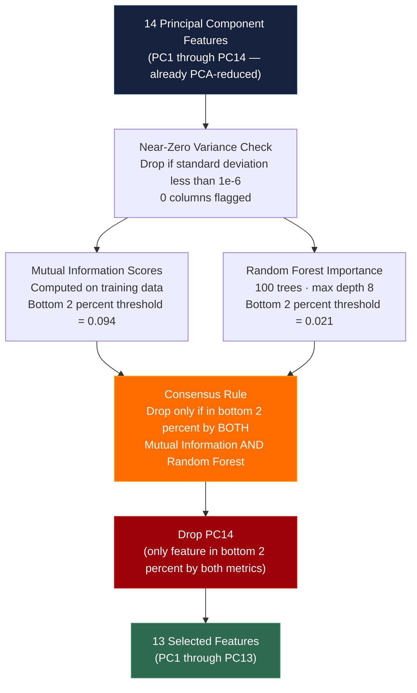
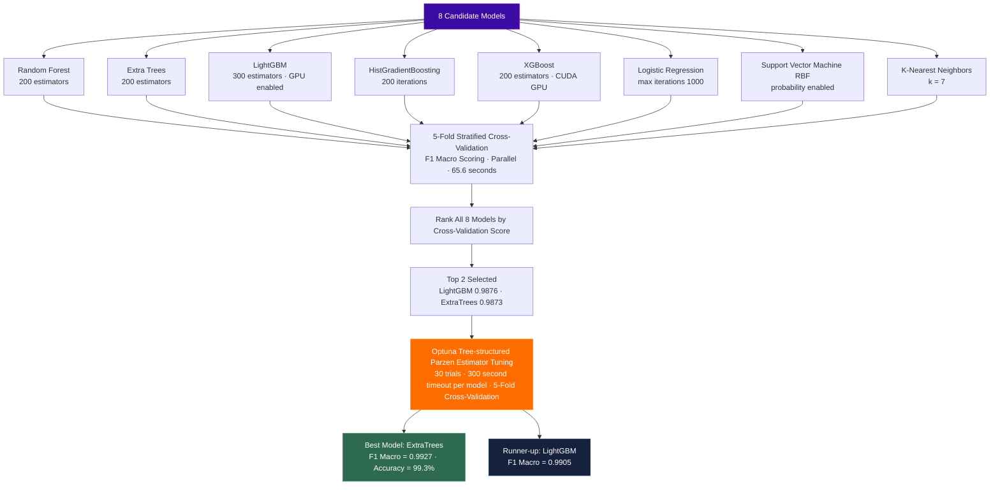
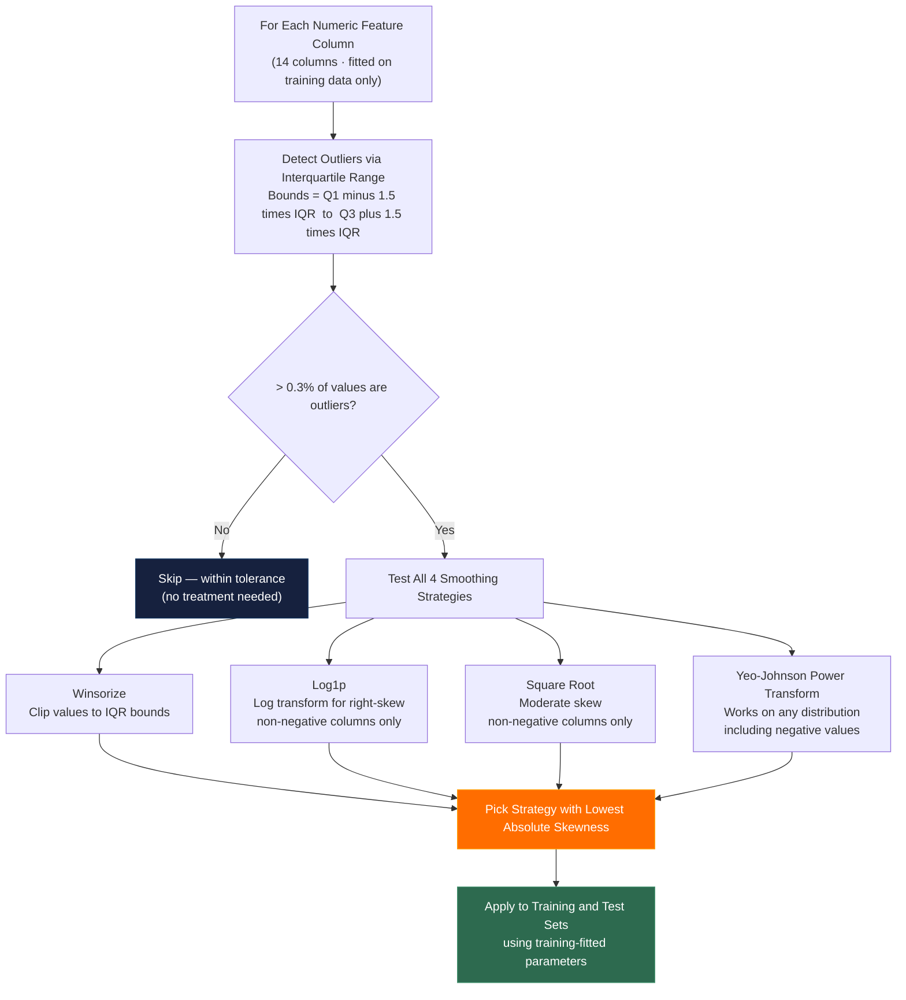
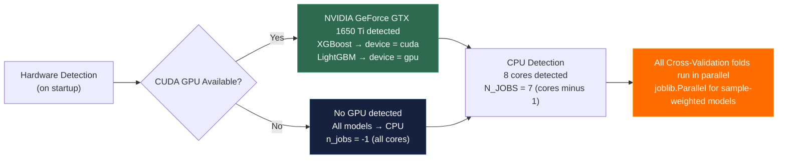
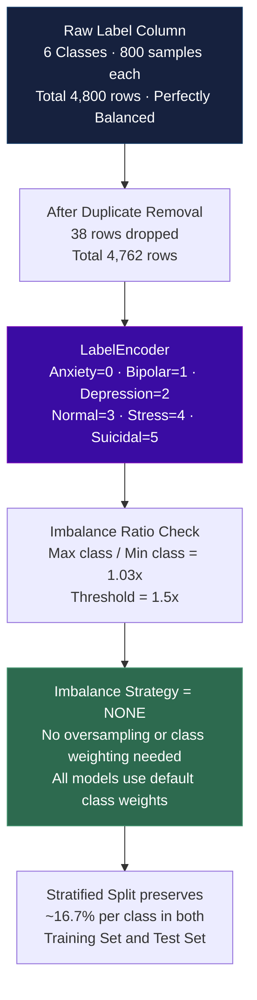
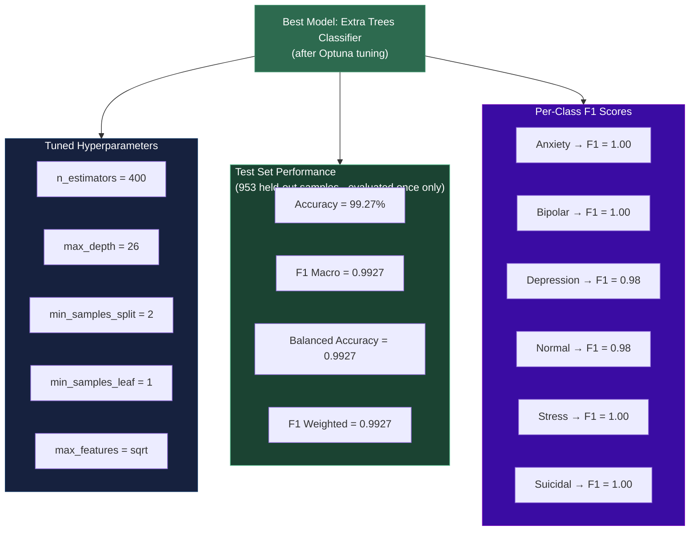
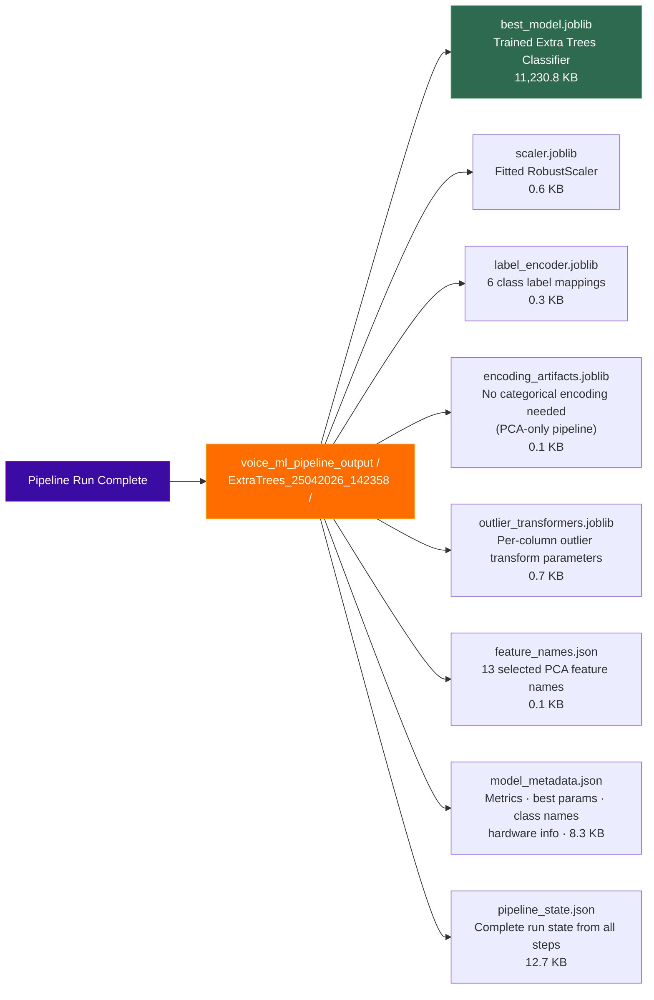

# Mindspace Voice Pipeline — Diagrams

## 1. End-to-End Pipeline Flow

```mermaid
flowchart LR
    %% ── Phase 1: Setup & Load ──
    subgraph P1[" "]
        direction TB
        S0(["⚙️ Step 0\nImports &\nHardware Detection"])
        S1(["📁 Step 1\nConfiguration"])
        S0 --> S1
    end

    subgraph P2[" "]
        direction TB
        S2(["📂 Step 2\nLoad CSV\n4,800 × 15"])
        S3(["🔍 Step 3\nColumn Overview\n14 PCA cols + label"])
        S35(["🎯 Step 3.5\nManual Setup\nTarget = label"])
        S2 --> S3 --> S35
    end

    subgraph P3[" "]
        direction TB
        S4(["🧪 Step 4\nData Profiling\n38 Duplicates · 0 Nulls"])
        S5(["✅ Step 5\nTarget Validation\n6 Classes · Balanced"])
        S6(["🧹 Step 6\nAuto-Clean\nDrop Duplicates → 4,762 rows"])
        S4 --> S5 --> S6
    end

    %% ── Phase 2: Split (the hard boundary) ──
    S7{{"✂️ Step 7\nTrain / Test Split\n3,809 / 953\nStratified 80 / 20"}}

    %% ── Phase 3: Train-only transforms ──
    subgraph P4["🔧 Transform (fitted on training set only)"]
        direction TB
        S8(["Step 8 · Outlier Smoothing\n4 strategies → lowest skewness\nYeo-Johnson · Winsorize"])
        S9(["Step 9 · Feature Selection\nMutual Information + Random Forest consensus\n14 → 13 features · PC14 dropped"])
        S10(["Step 10 · RobustScaler\nCenter on median · Scale by IQR"])
        S8 --> S9 --> S10
    end

    %% ── Phase 4: Model Training ──
    subgraph P5["🏋️ Train & Compare"]
        direction TB
        S11(["Step 11 · Shortlist\n8 candidate models"])
        S12(["Step 12 · 5-Fold Stratified Cross-Validation\nF1 Macro · parallel · 65.6 seconds"])
        S13(["Step 13 · Top-2 Selection\nLightGBM 0.9876 · ExtraTrees 0.9873"])
        S11 --> S12 --> S13
    end

    %% ── Phase 5: Tuning ──
    subgraph P6["🎛️ Tune"]
        S14(["Step 14 · Optuna Tree-structured Parzen Estimator\n30 trials · 300 second timeout · 5-Fold Cross-Validation\nExtraTrees improved to 0.9892"])
    end

    %% ── Phase 6: Evaluate & Save ──
    subgraph P7["✅ Deliver"]
        direction TB
        S15(["Step 15 · Final Evaluation\nAccuracy 99.3% · F1 Macro 0.9927\nConfusion Matrix · Per-Class Report"])
        S16(["Step 16 · Save\nmodel · scaler · encoder\ntransformers · metadata · state"])
        S15 --> S16
    end

    %% ── Connections ──
    P1 --> P2 --> P3
    P3 --> S7
    S7 -->|"Train 3,809 rows"| P4
    P4 --> P5 --> P6
    P6 --> P7

    %% ── Test set bypass (no leakage) ──
    S7 -.->|"Test 953 rows held out"| S15

    %% ── Styles ──
    style P1 fill:#1a1a2e,stroke:#e94560,color:#fff
    style P2 fill:#16213e,stroke:#0f3460,color:#fff
    style P3 fill:#16213e,stroke:#0f3460,color:#fff
    style S7 fill:#533483,stroke:#e94560,color:#fff
    style P4 fill:#0f3460,stroke:#53a8b6,color:#fff
    style P5 fill:#6a040f,stroke:#d00000,color:#fff
    style P6 fill:#ff6d00,stroke:#ff9e00,color:#fff
    style P7 fill:#2d6a4f,stroke:#40916c,color:#fff
```

---

## 2. Anti-Leakage Data Flow

---

## 3. Feature Selection Pipeline

---

## 4. Model Selection & Tuning Flow

---

## 5. Outlier Handling Strategy

**Results:** 13 of 14 columns treated — 11 columns used Yeo-Johnson, 2 columns used Winsorize, 1 column skipped.

---

## 6. Hardware Utilization

---

## 7. Class Distribution & Target Encoding

---

## 8. Final Model Performance

---

## 9. Saved Artifacts

